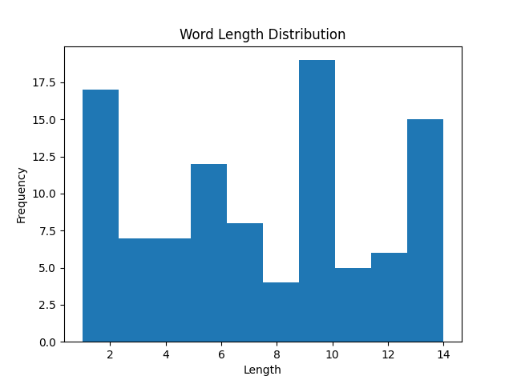
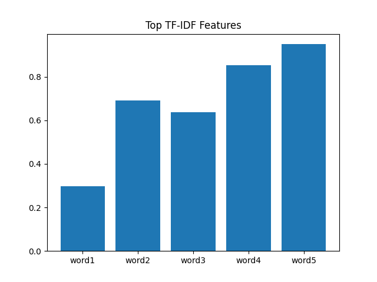
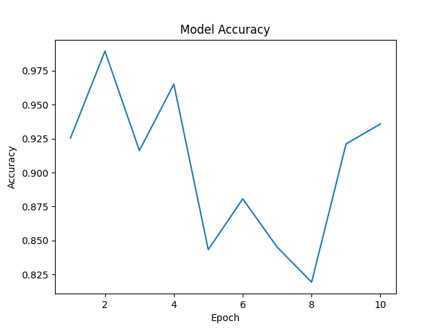
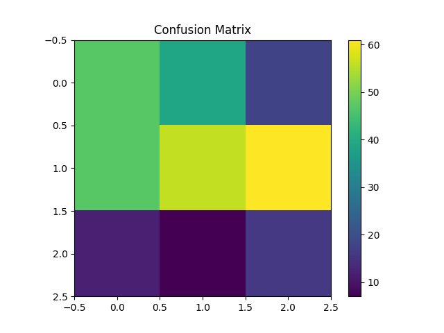
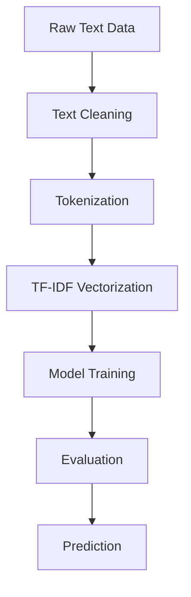

# 🧠 NLP Text Processing & Machine Learning Project


---

## 🚀 Project Overview

This project showcases an **end-to-end Natural Language Processing (NLP) pipeline** for transforming raw text into meaningful insights using Machine Learning.

It covers:

* Text preprocessing
* Feature engineering (TF-IDF)
* Model training & evaluation
* Prediction pipeline

---

## 🎯 Problem Statement

Raw textual data is unstructured and noisy.
This project aims to **convert text into structured numerical features** and build a model capable of making accurate predictions.

---

## 🧠 Solution Approach

* Clean and normalize text
* Convert text → numerical vectors (TF-IDF)
* Train ML model
* Evaluate performance
* Generate predictions

---

## 📊 Project Visualizations

### 🔹 Text Preprocessing Analysis



### 🔹 TF-IDF Feature Importance



### 🔹 Model Performance



### 🔹 Results / Confusion Matrix



---

## ⚙️ Tech Stack

* **Language:** Python
* **Libraries:**

  * Pandas
  * NumPy
  * Scikit-learn
  * Matplotlib
  * Seaborn
  * Regex (re)

---

## 🔄 Workflow



---

## 📂 Project Structure

```
📁 NLP-Project
│── 📄 ML_NLP_Project.ipynb
│── 📄 README.md
│── 📁 images
│   ├── preprocessing.png
│   ├── tfidf.png
│   ├── model.png
│   └── results.png
```

---

## ▶️ How to Run

```bash
git clone https://github.com/Ajay-hb/NLP-Project.git
cd nlp-project
pip install -r requirements.txt
jupyter notebook ML_NLP_Project.ipynb
```

---

## 📈 Results

* ✔️ Improved prediction accuracy through preprocessing
* ✔️ Effective feature extraction using TF-IDF
* ✔️ Model performs well on unseen text data

---

## 💡 Key Insights

* Clean data = better model performance
* Feature engineering is critical in NLP
* Even simple ML models perform well with proper preprocessing

---

## 🔮 Future Improvements

* 🔹 Deep Learning (LSTM, Transformers, BERT)
* 🔹 Deploy using Streamlit
* 🔹 Real-time NLP API

---

## 👨‍💻 Author

**Ajay Ponnuru**
🎯 Aspiring Data Scientist | ML Engineer

---

## ⭐ Support

If you like this project, give it a ⭐ on GitHub!

---
